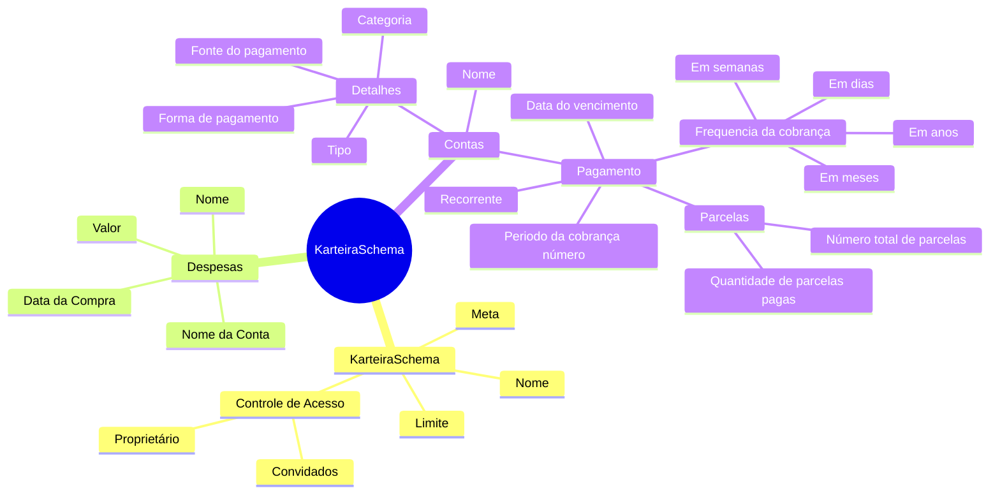
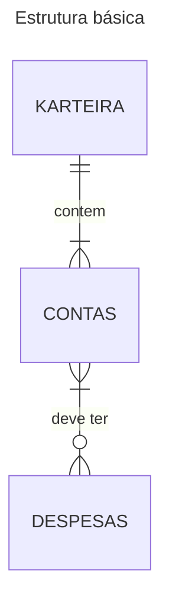
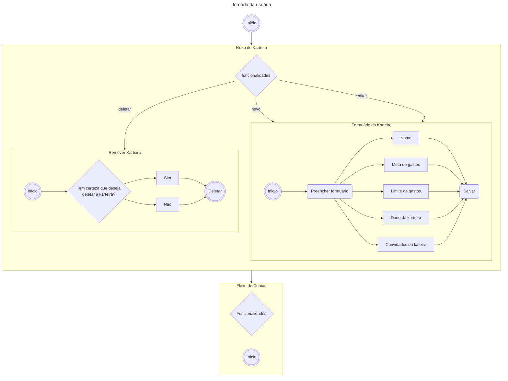

# KarteiraSchema Front

## Como funciona?

1. Cria uma karteira
2. Cria uma conta de pagamento para a karteira, que irá agrupar os gastos
2. Adiciona uma nova despesa/gasto a uma conta

### Diagramas

## ToDOing

### Despesas
- [x] Criar despesas
- [x] Editar despesas
- [x] Deletar despesa
- [x] Automatizar criação da parcelas despesas
- [x] Corrigir o bug quando edita despesa define o mês atual como pago se a data de vencimento já estiver passado.

### Pagamento
#### Conta individual
- [ ] Implementar modal para escolher as datas de pagamento
- [ ] Imeplementar lógica para pagar o mês
 
#### Pagamento em massa
- [ ] Implementar lógica para pagar todas os gastos de uma conta

## Features

- Visualizar as despesas por mês
  - Despesas por Conta
  - Despesas por cada campo em Detalhes
    - Categoria
    - Tipo
    - Forma de pagamento
    - Fonte do pagamento
- Saúde financeira
  - Exibir os dados da carteira
    - Meta
    - Limite
    - Somatório atual
  - Valor anual de gastos
    - Traçar um grafico representando o ano de acordo com o limite-meta / gastos-mes
