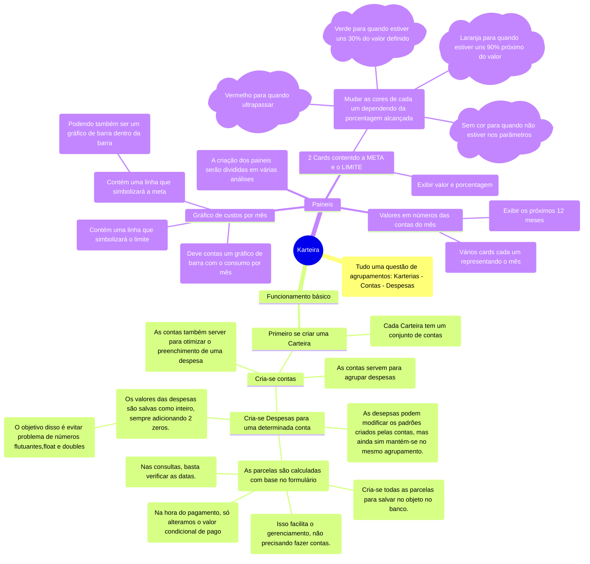
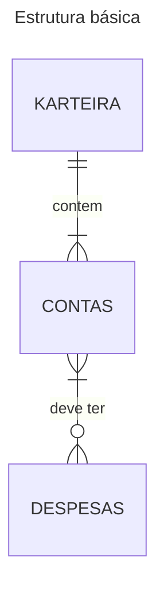
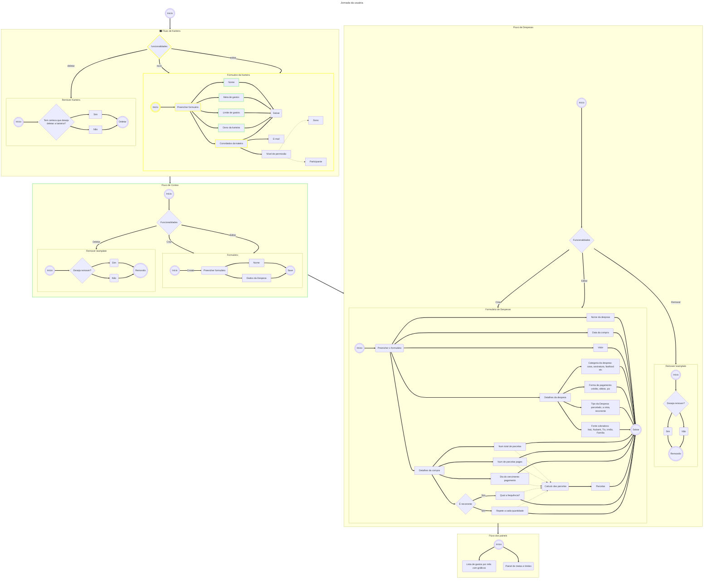

<link
  href="https://cdnjs.cloudflare.com/ajax/libs/font-awesome/6.7.2/css/all.min.css"
  rel="stylesheet"
/>

# Karteira

[Mermaidjs fontawesome icons](https://fontawesome.com/search?ip=classic&s=solid&o=r)

<!-- TOC -->
- [Karteira](#karteira)
  - [Como funciona?](#como-funciona)
  - [Diagramas](#diagramas)
    - [Estrutura básica](#estrutura-básica)
    - [Jornada da usuária](#jornada-da-usuária)
<!-- TOC -->

## Como funciona?

1. Cria uma karteira.
2. Cria uma conta de pagamento para a karteira, que irá agrupar os gastos.
3. Adiciona uma nova despesa/gasto a uma conta.

Funcionalidades:

## Diagramas

### Estrutura básica

### Jornada da usuária

